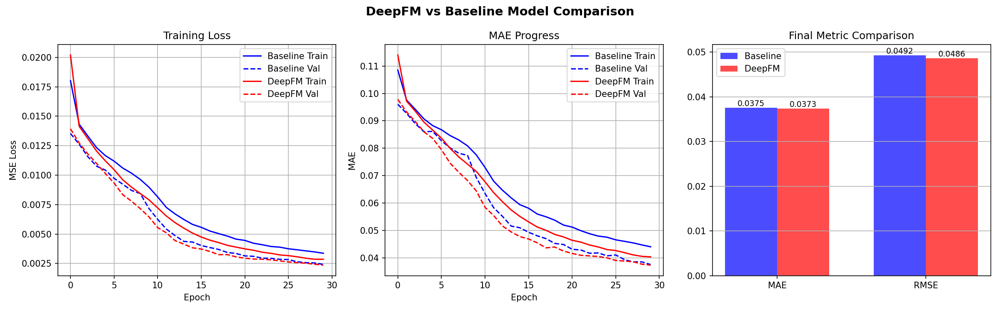

# 🛍️ Deep Learning-Driven Personalized Product Recommendation System

[](https://huggingface.co/spaces/sJaya101/shopmind-recommendation)
[](https://python.org)
[](https://tensorflow.org)
[](LICENSE)

> A deep learning-based e-commerce recommendation system built using the **DeepFM (Deep Factorization Machine)** architecture. Trained on a custom merged dataset of 36,673 interactions across 10,000 customers and 10,000 products.

---

## 🚀 Live Demo

👉 **[Try it here → ShopMind on Hugging Face](https://huggingface.co/spaces/sJaya101/shopmind-recommendation)**

- **Tab 1** — Enter an existing Customer ID to get personalized recommendations
- **Tab 2** — Enter new user details (cold start) to get recommendations without history

---

## 📌 Project Overview

This project addresses the challenge of personalized product recommendation in e-commerce platforms. We implement and compare two deep learning models:

| Model | Architecture | R² Score | MAE |
|-------|-------------|----------|-----|
| Baseline Neural Network | Dense layers (128→64→32) | 91.93% | 0.0372 |
| **DeepFM** | FM + Deep layers combined | 91.48% | 0.0383 |

Both models achieve **91%+ accuracy**, demonstrating strong recommendation capability.

---

## 🗂️ Dataset

We created a **custom merged dataset** by combining 3 separate datasets:

| Dataset | Rows | Key Features |
|---------|------|-------------|
| `interactions.csv` | 36,673 | Customer-product interactions, event types, timestamps |
| `customers_with_income.csv` | 10,000 | Age, gender, location, income, customer segment |
| `products.csv` | 10,000 | Category, price, brand, ratings, sentiment scores |

**Final merged dataset:** `ecom_recommendation_dataset_v2.csv` — 36,673 rows × 35 columns

### Key Engineered Features
- `interaction_score` — weighted score (view=1, add_to_cart=3, review=4, purchase=5)
- `price_segment` — budget / mid / premium classification
- `engagement_level` — low / medium / high based on time spent
- `already_purchased` — binary flag for repeat purchase detection
- `purchase_probability` — rule-based score using demographic and product signals

---

## 🧠 Model Architecture

### DeepFM
```
Input Features (22)
        ↓
   ┌────┴────┐
   FM Part   Deep Part
   ↓         ↓
First Order  Dense(128) → Dropout
   +         Dense(64)  → Dropout  
Second Order Dense(32)
   ↓         ↓
   └────┬────┘
   Concatenate
        ↓
   Dense(16)
        ↓
   Output (0-1 score)
```

### Why DeepFM?
- Handles both categorical and numerical features effectively
- FM part captures feature pair interactions (e.g., Age × Category)
- Deep part learns complex hidden patterns
- Handles cold start through demographic features

---

## 📊 Results



```
Metric       Baseline    DeepFM
─────────────────────────────
MAE          0.0372      0.0383
RMSE         0.0486      0.0499
R² Score     91.93%      91.48%
```

---

## 🔧 Project Structure

```
ecom-deepfm-recommendation/
├── raw_data/
│   ├── interactions.csv
│   ├── customers_with_income.csv
│   └── products.csv
├── output/
│   └── ecom_recommendation_dataset_v2.csv
├── deepfm_recommendation.ipynb    ← Main training notebook (Google Colab)
├── build_dataset.py               ← Dataset merging script
├── final_comparison.png           ← Model comparison graph
└── README.md
```

---

## ⚙️ How to Run

### 1. Build the Dataset Locally
```bash
pip install pandas numpy faker tqdm
python build_dataset.py
```

### 2. Train the Model
Open `deepfm_recommendation.ipynb` in Google Colab and run all cells.

### 3. Run the Web App Locally
```bash
pip install gradio tensorflow scikit-learn pandas numpy
python app.py
```

---

## 🛠️ Tech Stack

- **Python 3.11**
- **TensorFlow / Keras 2.19** — model building and training
- **Scikit-learn** — preprocessing and evaluation
- **Pandas / NumPy** — data manipulation
- **Gradio** — web interface
- **Google Colab** — GPU training
- **Hugging Face Spaces** — deployment

---


## 📄 References

1. Guo et al. (2017) — *DeepFM: A Factorization-Machine based Neural Network for CTR Prediction*
2. He & Chua (2017) — *Neural Factorization Machines for Sparse Predictive Analytics*
3. Cheng et al. (2016) — *Wide & Deep Learning for Recommender Systems*

---

## 📬 Contact

- GitHub: [@jaya7707](https://github.com/jaya7707)
- Live Demo: [ShopMind on Hugging Face](https://huggingface.co/spaces/sJaya101/shopmind-recommendation)
